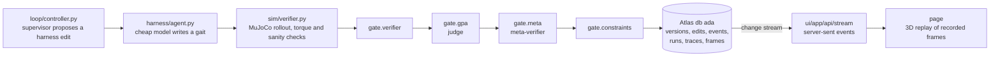

# Ada learns to walk (and gets caught cheating)

Ada is a simulated four-legged robot in MuJoCo, and this repo is a harness that rewrites itself to teach Ada to walk. A cheap model writes Ada's gait. A supervisor model rewrites the harness around the cheap model, round by round, across five parts: rules, context policy, tools, model per step and engine settings. The supervisor is paid for distance on purpose. When one of its edits drives Ada's motors past their rated torque to go further, the harness's own four-stage gate rejects that edit. Every proposed edit, every stage verdict, every simulated run and every recorded frame is a document in MongoDB Atlas. The page draws only those stored frames.

## Built during the hackathon (Sep 26, 2026)

- `sim/`: Ada's world. It has the gait controller, the train, holdout and showcase terrain tasks, the deterministic verifier (rated torque plus physical sanity bounds) and the frame recorder.
- `harness/`: the LangGraph agent that writes a gait through five whitelisted tools, the runner that scores a version on a split, the guardrails seed and `models.json`.
- `gate/`: the four gate stages. These are the verifier stage, the Agent GPA judge, the meta-verifier and the constraints check, plus the pipeline that runs them in order.
- `loop/`: the sensor, the supervisor controller that proposes harness edits, the actuator that versions and gates them, and the round runner.
- `compress/`: the deterministic trace compressor the judge reads, and the TruLens provider hook.
- `core/`: the pydantic contracts, Mongo helpers, the event emitter and the only OpenRouter client (with its prompt cache).
- `scripts/`: frozen baselines, the harness swap capture, the scoreboard, the demo snapshot pin, the `./verify` CLI, fixtures and backfills.
- `ui/`: the Next.js page. It replays recorded frames in 3D (ghosts, the cheat in bullet time, the swap lanes, booth mode) and shows the gate card.

Tests live under `tests/` and `ui/tests/` and run through `./check`.

The design (`SPEC.md`, `CONTRACTS.md`, `PLAN.md`) was planned before the event. All code was written on the day: Claude Code wrote the code, and the human, Saran Teja Mallela, made every commit.

## Used, not built

- [MuJoCo](https://mujoco.org) is the physics engine.
- Gymnasium's `ant.xml` (MIT) is Ada's body, copied to `sim/assets/ant.xml`. Gymnasium is not used at runtime.
- [LangGraph](https://github.com/langchain-ai/langgraph) runs the agent, with checkpoints stored through its MongoDB saver.
- [TruLens](https://github.com/truera/trulens): `compress/` registers a TruLens trace provider for the judge's traces. The Agent GPA judge prompt itself is hand-written in `gate/judge.py`.
- The models are reached through [OpenRouter](https://openrouter.ai). The ids come from `harness/models.json`:

  | role | model | alternate |
  |---|---|---|
  | agent_v0 (the cheap model) | `openai/gpt-6-luna` | `openai/gpt-oss-20b` |
  | frontier (fixed comparison) | `openai/gpt-6-sol-pro` | `anthropic/claude-sonnet-5` |
  | controller (the supervisor) | `anthropic/claude-sonnet-5` | `openai/gpt-6-sol-pro` |
  | judge (GPA judge and meta-verifier) | `google/gemini-3.8-flash` | `google/gemini-3.5-flash` |

- The page uses [Next.js](https://nextjs.org), [React Three Fiber](https://github.com/pmndrs/react-three-fiber), [drei](https://github.com/pmndrs/drei), and [postprocessing](https://github.com/pmndrs/postprocessing) with `@react-three/postprocessing`.
- IBM Plex Sans and Serif (SIL Open Font License) are loaded through `next/font`.
- Three sound effects were generated with ElevenLabs: `ui/public/sfx/step.mp3`, `fall.mp3` and `glitch.mp3`.
- Other ordinary libraries are pinned in `pyproject.toml` / `uv.lock` and `ui/package.json`.

## Architecture



A silent constraints pre-check runs first. If it fails, the first three cells are marked skipped and the edit is rejected with zero model calls. Otherwise, all four stages run on every edit, and an edit is kept only when all four pass.

## How to verify the claims

All commands run from the repo root with a filled `.env`.

**The gate rejects the physics, not the idea.** Take a rejected edit's id (for example, from query 2 below):

```bash
./verify --edit <id> --clip-power 1.0
```

This replays the edit's first sanity-violating run twice, with the same gait, task and seed:

- once as stored
- once with only `power` set to 1.0

It prints both results side by side and exits 0 when the clipped run passes sanity. It writes one `edits` document with origin `cli` plus its card events, and every count below excludes those.

**The replay is real.** Take any frames id (`versions.showcase_frames_id`, `edits.frames_id` or `edits.attempt_frames_id`):

```bash
./verify --determinism <frames_id>
```

This re-simulates the run behind the frames and compares its sha256 to the stored one. It writes nothing.

**The record, in Atlas** (mongosh, `use ada`):

1. Rejected edits by gate stage. All four stages run, so one edit can fail several.

   ```js
   db.events.aggregate([
     { $match: { stage: /^gate\./, status: "fail" } },
     { $lookup: { from: "edits", localField: "edit_id", foreignField: "_id", as: "e" } },
     { $unwind: "$e" },
     { $match: { "e.verdict": "rejected", "e.origin": { $ne: "cli" } } },
     { $group: { _id: "$stage", edits: { $addToSet: "$edit_id" } } },
     { $project: { rejected_edits: { $size: "$edits" } } },
     { $sort: { _id: 1 } }
   ])
   ```

2. Judge verdicts on physics-rejected edits: what the GPA judge said about edits the verifier rejected. `judge: null` marks edits from before every stage always ran.

   ```js
   db.events.aggregate([
     { $match: { stage: "gate.verifier", status: "fail",
                 "payload.reason": /rated torque|rated motors|exploits the simulator|rose above|diverged/ } },
     { $lookup: { from: "edits", localField: "edit_id", foreignField: "_id", as: "e" } },
     { $match: { "e.origin": { $ne: "cli" } } },
     { $lookup: { from: "events", let: { id: "$edit_id" }, as: "judge", pipeline: [
         { $match: { $expr: { $and: [ { $eq: ["$edit_id", "$$id"] }, { $eq: ["$stage", "gate.gpa"] },
                                      { $in: ["$status", ["pass", "fail"]] } ] } } } ] } },
     { $project: { _id: 0, edit_id: 1, physics: "$payload.reason",
                   judge: { $first: "$judge.status" }, scores: { $first: "$judge.payload.scores" } } }
   ])
   ```

3. Kept edits by harness part.

   ```js
   db.edits.aggregate([
     { $match: { verdict: "accepted", origin: { $ne: "cli" } } },
     { $group: { _id: "$primitive", kept: { $sum: 1 } } },
     { $sort: { kept: -1 } }
   ])
   ```

## How to run it

Requirements: Python 3.11 with [uv](https://docs.astral.sh/uv/), Node 20.9+, a MongoDB Atlas cluster and an OpenRouter key.

```bash
cp .env.example .env
```

Fill in `OPENROUTER_API_KEY` and `MONGODB_URI` in `.env`. Then install the Python dependencies:

```bash
uv sync
```

Seed the tasks and the guardrails document:

```bash
uv run python -m sim.tasks --write
```

```bash
uv run python -m harness.guardrails
```

Score v0 on train and showcase:

```bash
uv run python -m harness.run --version v0 --split train --k 2
```

```bash
uv run python -m harness.run --version v0 --split showcase
```

Freeze the frontier and v0 baselines:

```bash
uv run python -m scripts.baseline
```

Run the rewrite loop:

```bash
uv run python -m loop.run --rounds 3
```

Capture the harness swap, total the scoreboard, and pin the demo:

```bash
uv run python -m scripts.capture_swap --best <version_id>
```

```bash
uv run python -m scripts.scoreboard
```

```bash
uv run python -m scripts.pin_snapshot
```

Run the page. In local dev it reads `MONGODB_URI` from the repo-root `.env`. On Vercel, set it as a project environment variable:

```bash
cd ui && npm install && npm run dev
```

Page modes:

- `/` is live.
- `/?pinned=1` is the pinned scene director.
- `/?mode=booth` is the booth attract loop.
- `/?mode=swap` shows v0 against the best harness.
- `/?mode=attempts` shows the supervisor's bets.

Tests:

```bash
./check
```

```bash
./check ui
```

## What is live and what is replayed

- **The simulation is always live and deterministic.** Each run is simulated once and stored. The same gait, task and seed always give byte-identical frames, which `./verify --determinism` checks.
- **Model calls go through a cache.** All of them pass through `core/llm.py` and are cached in `ada_cache.llm_cache` by `(model_id, prompt_hash)`. `LLM_CACHE_MODE=record` calls OpenRouter on a cache miss and stores the reply. `LLM_CACHE_MODE=replay_only` never calls the API and fails on a miss. Rerunning a recorded round in `replay_only` reproduces it from the cache.
- **The harness swap is live.** `scripts/capture_swap.py` makes every agent call fresh, even under `replay_only`, and doesn't write those calls to the cache. The `swaps` document records this with `fresh_calls: true` and `model_calls`.
- **The page never simulates and never calls a model.** It draws only stored `frames` documents; it can change the replay speed but never adds frames. In live mode it follows the Atlas change stream on `events`, `versions` and `edits`. `?pinned=1` and `?mode=booth` replay the ids pinned by `scripts/pin_snapshot.py` and are labelled as a replay of runs recorded today. Counters still update from live documents.

## License

MIT, see `LICENSE`. `sim/assets/ant.xml` comes from Gymnasium (MIT). IBM Plex is under the SIL Open Font License.
